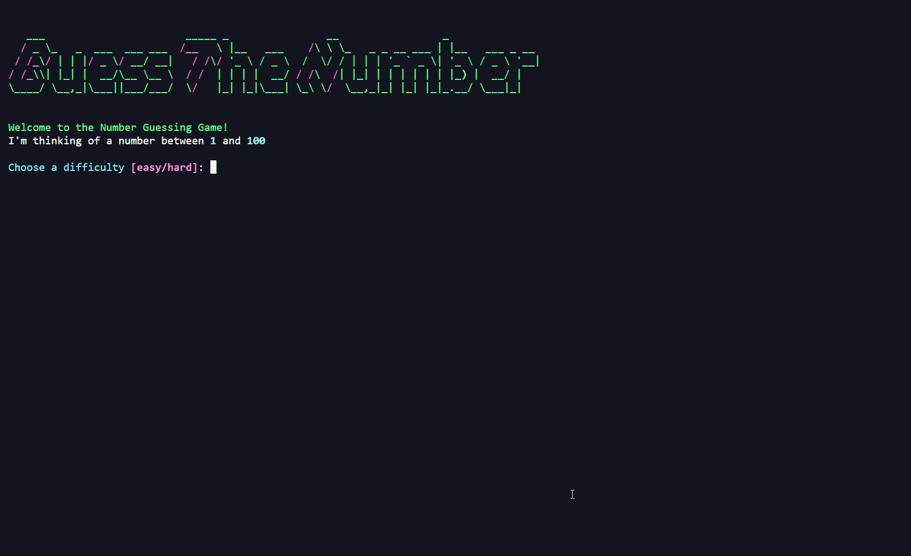

# Number Guessing Game

A CLI game where the user has to guess a number in the range of 1 to 100.



## Run only

Use [pipx](https://pypa.github.io/pipx/) to run without permanently installing.

```
pipx run --spec git+https://github.com/ig0r-ferreira/number-guessing-game.git number_guessing_game
```

## Install and Run

### [pipx](https://pypa.github.io/pipx/)
  
1. Install in an isolated environment with:
    ```
    pipx install git+https://github.com/ig0r-ferreira/number-guessing-game.git
    ```

2. Run:
    ```
    number_guessing_game
    ```

### [poetry](https://python-poetry.org/)

1. Open a terminal on your desktop or wherever you like and run the command below to clone the project:
    ```
    git clone https://github.com/ig0r-ferreira/number-guessing-game.git
    ```

2. Go to the project folder with:
    ```
    cd number-guessing-game
    ```

3. Install with:
    ```
    poetry install --without dev
    ```

4. And finally run:
    ```
    poetry run number_guessing_game
    ```